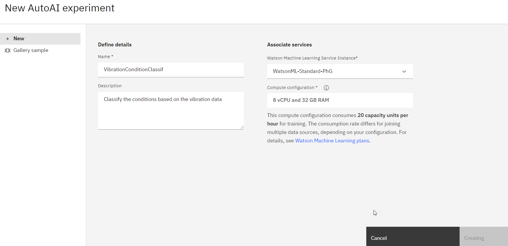
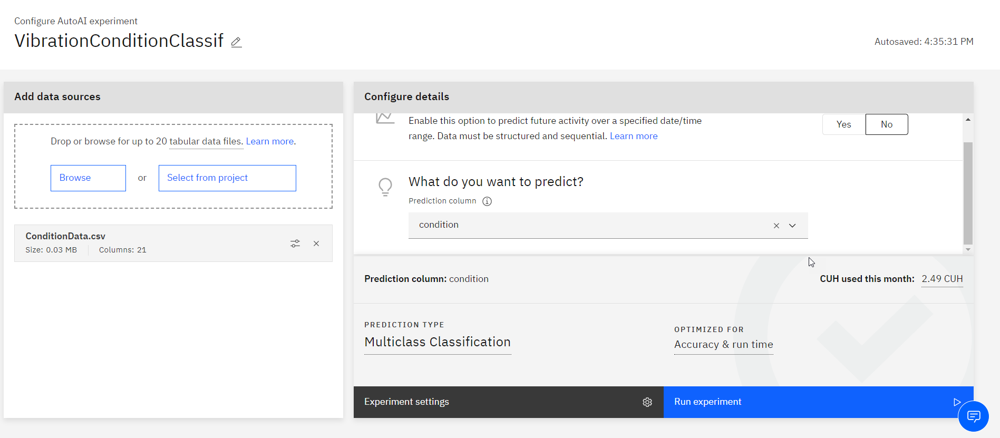
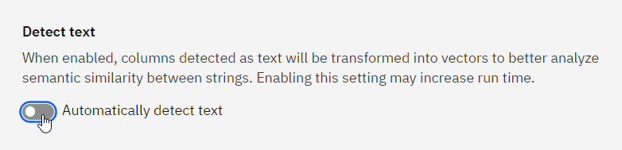
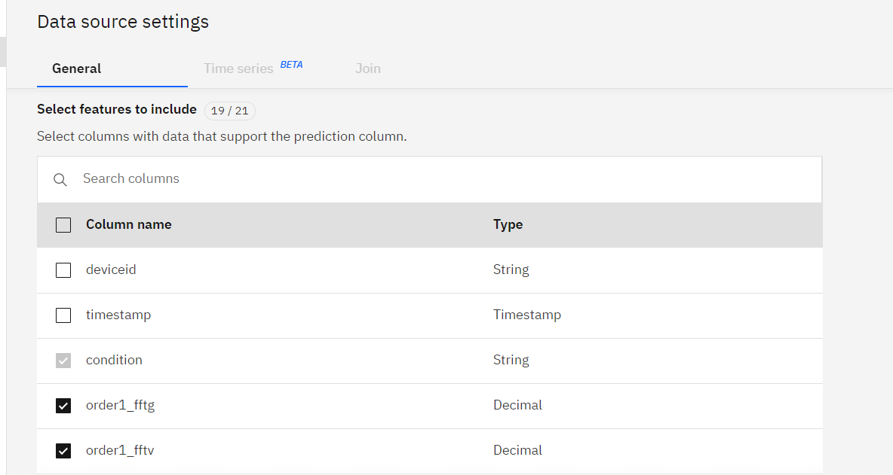
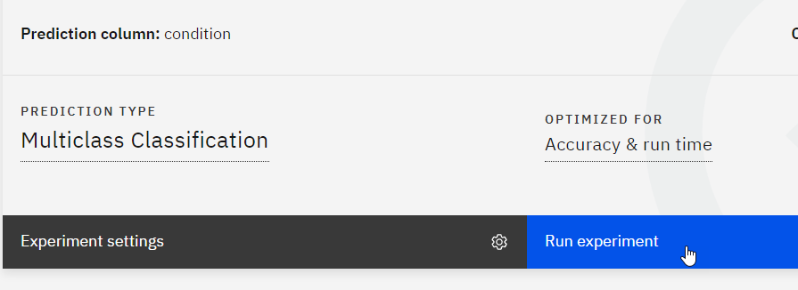

Click on Experiment Settings to remove the deviceID and timestamp from predictors

In *Data Source* tab:
1. Unselect text detection

1. Remove `deviceid` and `timestamp` columns from selected features

Back to main selection, select *Run experiment*

